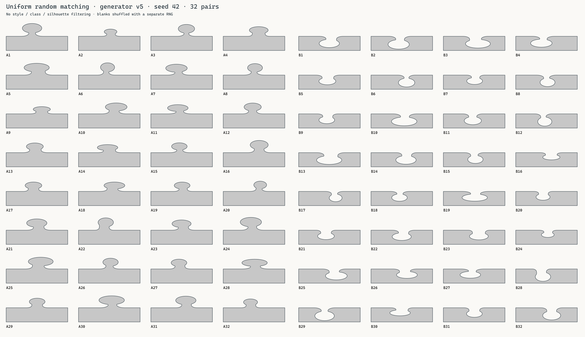
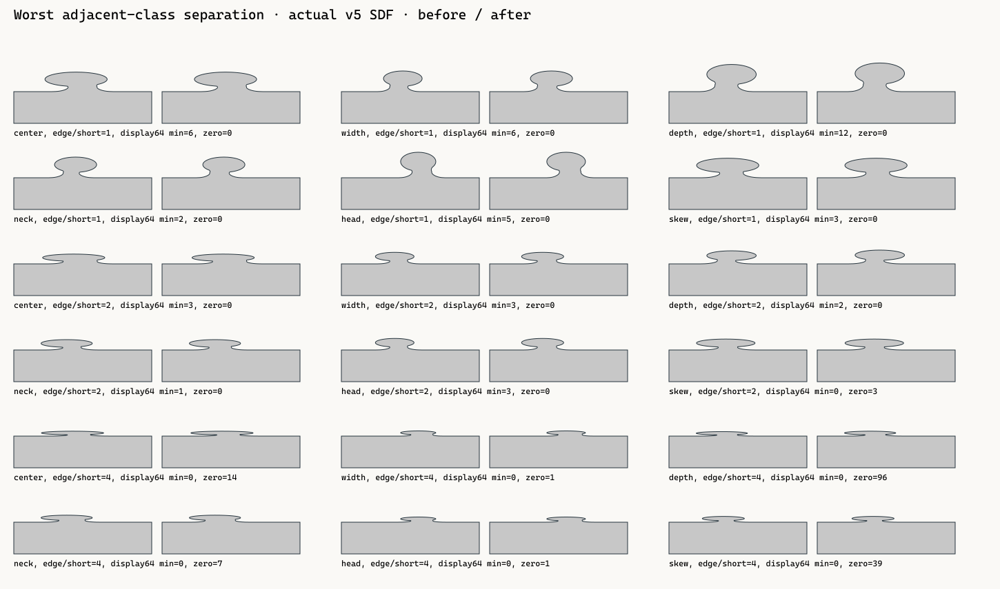
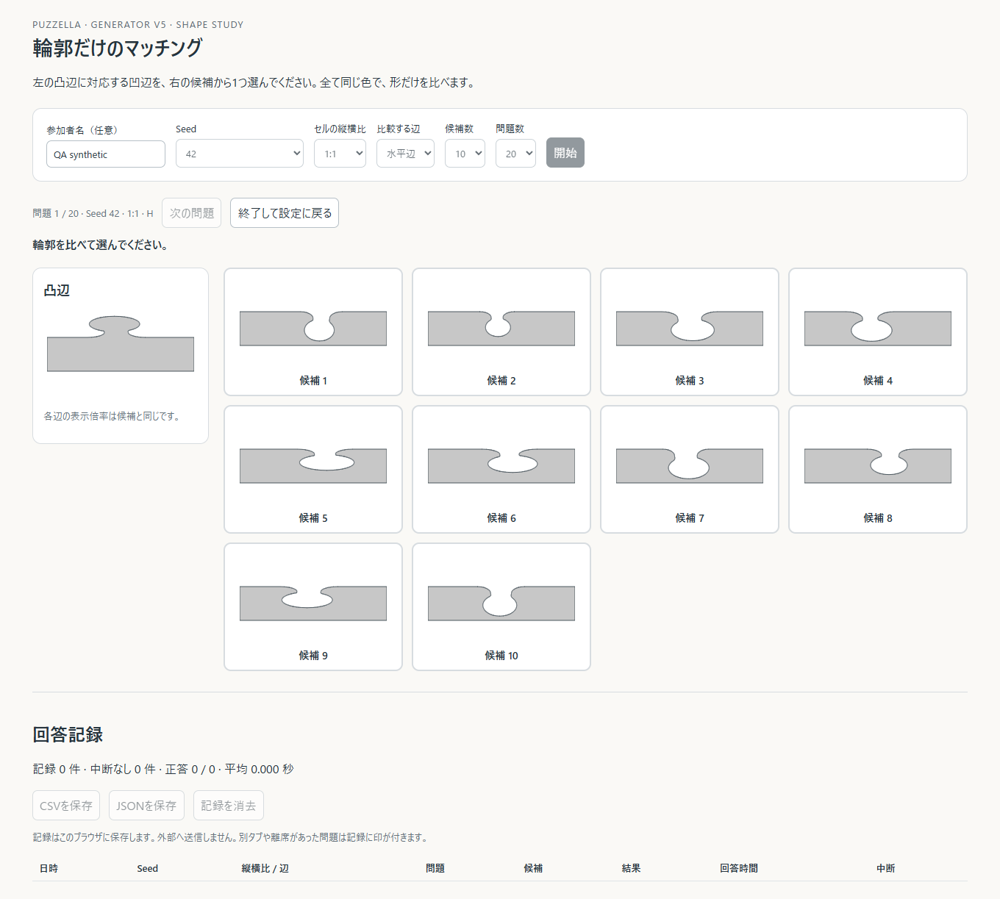

# generator v5の識別性評価の強化

形状定義の基準は`2a9d23b85cf3f1c4324a47b28047255039209d6c`です。`puzzle/src/procedural.rs`、`game/src/render/puzzle_shape.wgsl`、`core/src/gameplay.rs`は変更していません。hash、decode、SDF、generator version、通常renderer、pickingの挙動はそのままで、test/reference featureとexampleだけに評価・toolを追加しました。

指定した5項目を実装しました。無作為な候補集合でもv5はv4より輪郭距離が大きい一方、**長辺を64 px幅で表示すると、一部の隣接classが同じbinary maskになります**。256 px幅の今回のworst-case評価では全隣接classが分離しました。人間の正答率や回答時間はまだ収集しておらず、それを測るtoolを用意した段階です。

## 1. 無作為の32組matching

seedは`1, 42, 2026, 1311768467463790320`の4種類。1000×1000 gridの**1,998,000 internal edges**（水平999,000、垂直999,000）から、ChaCha8Rngで32個のEdgeIdを一様に重複なしで抽出します。profileを生成する前にIDを決め、style、class、輪郭距離を使った選別はありません。凹の順番は別domainのRNGによるFisher–Yates shuffleです。

既存`edge_fingerprint_preview`にあった「各styleの特徴的な例を探す」処理も削除し、24組の無作為抽出に置き換えました。[初期実装の報告](EDGE_FINGERPRINT.md)に保存された意図的選別の図は過去のfixtureです。現在の識別性の評価には、以下の無作為fixtureを使います。

- [seed 1](benchmarks/edge-assessment/random-matching-1.png)
- [seed 42](benchmarks/edge-assessment/random-matching-42.png)
- [seed 2026](benchmarks/edge-assessment/random-matching-2026.png)
- [seed 1311768467463790320](benchmarks/edge-assessment/random-matching-1311768467463790320.png)

[manifest CSV](benchmarks/edge-assessment/random-matching-manifest.csv)に、seed、A/Bの対応、orientation、EdgeIdの座標、raw 2値を記録しています。各seedでA/Bが32個ずつ一度だけ現れ、同じrawを凸/凹へ反転しています。全て同じ塗り・線で、画像・class名・style名を手がかりにしません。



## 2. 縦横比別の輪郭指標

セルのwidth:heightを1:1、2:1、4:1、1:2、1:4に分け、水平Hと垂直Vを別に測ります。Hのlengthはセルwidth、Vはheight、depthに使うshortは常に両者の最小値です。例えば4:1のHはlength=400/short=100、Vは100/100になります。Vも比較時はcanonicalな向きへ回転しますが、縦横比をsquareへ変更しません。

各seed・orientationで**512個の無作為internal EdgeId**を抽出し、同じID集合をv4/v5と全縦横比で使います。自身を除いた511本からHamming最小の最近傍を選び、そのペアのIoUも記録します。v4は既存の凍結reference decoder、v5は既存の`edge_distance()`です。polarityだけ凸へ正規化し、centerや幅を揃える処理はありません。

2種類のsamplingを区別しました。

| raster | sampling領域・間隔 | 評価するもの |
| --- | --- | --- |
| normalized64 | 64×32、x=0..length、y=0..0.22×short | tab帯を高さ32 pixelへ拡大した輪郭差。pixelは等方ではない |
| display64 | 64×32、dx=dy=length/64 | 辺全幅を64 pixelへ等方表示した差。長辺のtabが低く見える効果を含む |
| display256 | 256×128、dx=dy=length/256 | class寄与の高解像度確認（次節） |

normalized64とdisplay64はどちらも2048 bitsですが、yのsampling間隔が異なります。normalized64だけでは、長辺を小さく表示したときの情報損失を捉えられません。HTMLはSVGのanti-aliasあり、指標はpixel中心のbinary maskでanti-aliasなしです。

以下は4seed×512本の測定の平均です。最近傍探索はseedごとの512本内で行い、4seedを混ぜて2048候補の探索はしていません。

| セル比 | 辺 | normalized64平均Hamming v4→v5 | display64平均Hamming v4→v5 | display64のv5 Hamming=0の辺数 / 2048 |
| --- | --- | --- | --- | ---: |
| 1:1 | H | 8.762 → **35.742** | 3.443 → **15.292** | 0 |
| 1:1 | V | 8.867 → **35.851** | 3.507 → **15.297** | 0 |
| 2:1 | H | 8.804 → **35.785** | 1.499 → **7.403** | 14 |
| 2:1 | V | 8.867 → **35.851** | 3.507 → **15.297** | 0 |
| 4:1 | H | 8.783 → **35.836** | 0.404 → **3.170** | 70 |
| 4:1 | V | 8.867 → **35.851** | 3.507 → **15.297** | 0 |
| 1:2 | H | 8.762 → **35.742** | 3.443 → **15.292** | 0 |
| 1:2 | V | 8.911 → **35.902** | 1.463 → **7.444** | 6 |
| 1:4 | H | 8.762 → **35.742** | 3.443 → **15.292** | 0 |
| 1:4 | V | 8.944 → **35.960** | 0.415 → **3.216** | 48 |

全seed別・集計値、p10、中央値、min、zero count、正規化Hamming、IoUは[aspect CSV](benchmarks/edge-assessment/aspect-silhouette-metrics.csv)に保存しています。`seed=all`は4seed内の最近傍結果を結合した集計です。4:1 Hのdisplay64ではv4のzero countが1335、v5が70でした。改善しても小さい表示での完全識別には至りません。

## 3. 各macro軸の実効寄与

4seedから16本ずつ、計64個の無作為profileをcontextとします。各contextについて、center/skewの全6隣接境界、width/depth/neck/headの全3隣接境界を測ります。contextごとに全24境界、合計1536比較です。

**変更するのは1つのsampleのclassだけ**です。他の5 sample、style、polarityは完全に固定します。元sampleの残差に最も近いbyteを各classから選びます。4class軸では残差を厳密に維持できます。7class軸では整数packingの都合で最大6 residual単位、signed microで最大12/255の差が残ります。centerの実値で最大約0.00019、skewで最大約0.00024の差で、macro間隔より小さいですが、完全にmicro=同一とは主張しません。

widthを変えるとhead/neckの絶対幅、headを変えるとneck幅、これらとskewを変えると安全envelopeに応じたcenterも変わり得ます。これらは固定したv5 decoderの依存関係です。測っているのは**macro軸の実効寄与**で、decoded浮動小数点fieldを不自然に1つだけ書き換えた形状ではありません。別軸のclassとbyteが変わっていないことはテストしています。

| 軸 | 無作為contextのnormalized64平均Hamming（1:1） | display64平均Hamming（1:1） | display64平均Hamming（長辺4:1） | 長辺4:1のdisplay256平均Hamming |
| --- | ---: | ---: | ---: | ---: |
| center | **84.661** | 37.169 | 8.974 | 148.596 |
| width | 32.797 | 14.292 | 3.438 | 57.542 |
| depth | 47.667 | 21.047 | 4.688 | 84.880 |
| neck | **10.281** | **4.563** | **1.464** | **18.354** |
| head | 30.479 | 13.510 | 3.313 | 54.094 |
| skew | 22.190 | 9.682 | 2.159 | 38.740 |

このcontext集合ではcenterが最大、neckが最小の寄与です。無作為contextの1:1 display64でもneckには4/192比較でHamming=0がありました。長辺4:1ではcenter以外の5軸にzeroがあります。表示幅やcontextによって、parameterが異なるだけではpixelとして区別できません。

H/V・全5比・3raster・軸別・隣接境界別の値は[axis CSV](benchmarks/edge-assessment/axis-contribution.csv)です。`from_class=-1,to_class=-1`が軸の全境界を合わせた行、他は特定の隣接classの行です。各行に最も小さかった比較の変更前後rawを含めており、潰れた例を再構成できます。

## 4. large head + wide + extreme skewの分離

既存worst casesの384 contextを使用します。全6style、最大width/head、center両端、skew両端、neck/depth各4classです。そこから各軸の全隣接classを比較し、9216比較/geometry/rasterを測ります。変更対象の軸以外は極端なcontextを保持します。width/head/skew自身を比較する場合、その軸だけ隣接classへ変更するため、両方の比較形状が同じ極端値になるわけではありません。

以下のratioは**edge length / short**で、4:1セルのHと1:4セルのVがratio=4です。

| 軸 | 比較数 | display64 min ratio1 / ratio2 / ratio4 | display64 zero ratio1 / ratio2 / ratio4 | display256 min ratio1 / ratio2 / ratio4 |
| --- | ---: | --- | --- | --- |
| center | 2304 | 6 / 3 / **0** | 0 / 0 / **14** | 147 / 73 / **36** |
| width | 1152 | 6 / 3 / **0** | 0 / 0 / **1** | 164 / 79 / **39** |
| depth | 1152 | 12 / 2 / **0** | 0 / 0 / **96** | 262 / 128 / **49** |
| neck | 1152 | 2 / 1 / **0** | 0 / 0 / **7** | 67 / 31 / **17** |
| head | 1152 | 5 / 3 / **0** | 0 / 0 / **1** | 153 / 77 / **38** |
| skew | 2304 | 3 / **0** / **0** | 0 / **3** / **39** | 78 / 39 / **19** |

normalized64ではratio1/2/4の全比較が非zero、display256でも全比較が非zeroです。centerの安全制限を含む実decoderを使ったうえで、今回のcontext集合には高解像度でのclassの完全な潰れはありません。**ただしdisplay64ではratio4の6軸すべてにzeroがあり、計158/9216比較（約1.71%）で同じmaskになりました。ratio2でもskewに3件あります。**

この「worst」は要求された大きいhead/width/skewの極端条件で、全形状の視認性についての数学的な最悪点ではありません。実際、無作為contextのratio4 display64は74/1536比較（約4.82%）がzeroでした。小さいheadや浅いtabも視認性を悪化させ得ます。形状は今回変更せず、これらの限界を測定結果として残します。

下図はdisplay64で最も近かった変更前後のペアを、確認しやすい200 px幅で表示しています。図で微小差が見えても、64 pxのmaskで差がない場合があります。



## 5. 人間向けのmatching tool

`target/edge-assessment/edge-matching-tool.html`を生成しました。単独のHTMLで、外部ライブラリ・外部通信・ゲーム起動が不要です。ブラウザで開き、seed、セル比、H/V、候補8/10/12、問題10/20を選んで開始します。左に凸1本、右に凹候補を配置し、全形状を同じ灰色・同じ200 CSS px幅で描きます。正解の枠は回答後だけ表示します。

4seed×2orientationごとに64辺を無作為に抽出し、20問のtarget/distractorを輪郭に関係なく抽出しました。8/10/12候補にはそれぞれ独立したshuffleを用い、正解位置を偏らせる「shuffle後に正解だけ残して切り詰める」処理はしません。同じseed/設定で同じ問題を再現できます。似た候補を避ける処理や、簡単な問題の選別もありません。

SVGの輪郭は既存Rust `sd_tab`のzero contourをofflineでsampleしたもので、HTMLへ別のgeneratorを実装していません。水平/垂直をcanonicalな向きで並べ、length/short比は実セルの辺に合わせます。回答時間は描画後の`performance.now()`から最初の選択までで、最初の回答だけ記録します。離席/別タブへの切替を検出した問題は`interrupted=true`とし、画面の通常集計から除外します。

ブラウザ内保存とCSV/JSON exportには以下を含みます。

- generator/schema version、session ID、任意の参加者名、seed、セル比、orientation、候補数、問題番号
- 選んだ候補、正解候補、正誤、回答時間ms、中断の有無、回答日時
- target/chosenのEdgeId・raw、target macro classes、全候補のEdgeId/raw
- 64 px maskがtargetと一致する候補数（粗いsamplingでのalias指標であり、人間に完全同形に見えるという判定ではありません）

同じseedの繰り返しには学習効果があります。実験ではseed/順序、候補数、縦横比を記録して分けて集計してください。現時点では人間の測定値はありません。下図と自動テストの回答は**QA synthetic**で、人間の能力の評価には含めません。



## 再生成と検証

```sh
# 全指標・無作為fixture・HTMLを生成
cargo run --release --locked -p puzzella-puzzle --features cpu-geometry-reference --example edge_fingerprint_assessment -- target/edge-assessment
# HTMLだけ再生成（数値評価を再実行しない）
cargo run --release --locked -p puzzella-puzzle --features cpu-geometry-reference --example edge_fingerprint_assessment -- target/edge-assessment --tool-only
```

SVG/HTMLはtargetに生成し、PNG・数値CSV・manifestは`benchmarks/edge-assessment/`に保存しました。HTMLは約7 MBです。ローカルファイルのブラウザ保存が利用できない環境ではexportを使うか、localhostで配信します。

```sh
python -m http.server 8785 --bind 127.0.0.1 --directory target/edge-assessment
# http://127.0.0.1:8785/edge-matching-tool.html
```

任意の既存Playwright環境で`puzzle/examples/support/test_edge_matching.cjs`を実行できます。`MATCHING_PLAYWRIGHT_MODULE`にmodule path、`MATCHING_BROWSER_EXE`に既存Chrome/Edge pathを指定可能です。480候補集合の一意性/正解1個、正誤、時間、二重回答防止、ブラウザ保存、CSV/JSON export、8/10/12候補、縦横比とH/V、中断フラグ、390 px画面のレイアウトを実ブラウザで確認しました。

`cargo fmt --check`、`cargo check --locked`、全target/featureのclippy（warnings拒否）、通常/全featureのテスト、buildを実行しました。通常49件が通過。形状・shader・versionファイルは基準commitとの差分なし、SHA-256も作業前後で同じです。実GPUは今回変更していないため、初期v5のGPU検証/性能値を[前報](EDGE_FINGERPRINT.md)に保持し、今回は再計測していません。
