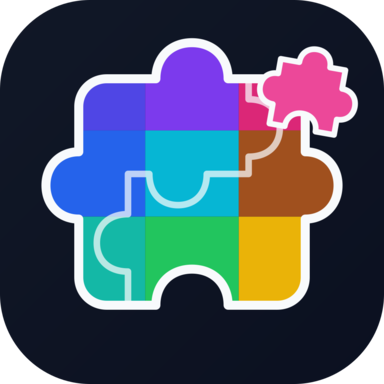

<p align="center">
  
</p>

<h1 align="center">Jigsall</h1>

任意の画像からパズルを生成する、Rust + Bevy 製のジグソーパズルゲームです。シングルプレイ、Direct-IP と Room Code によるマルチプレイに対応しています。

<p align="center">
  <a href="#ビルドと起動">ビルドと起動</a> ·
  <a href="#マルチプレイ">マルチプレイ</a> ·
  <a href="docs/PLAYING.md">遊び方ガイド</a> ·
  <a href="docs/DEVELOPMENT.md">開発ガイド</a>
</p>

## 主な機能

- PNG・JPEG・BMP・GIF・WebP からのパズル生成
- 最大 1000 × 1000（100 万）ピース。分割数、シード値、回転の有無を設定可能
- ピースの連結、範囲選択、複数ピースの移動、90° 単位の回転
- 元画像を含むローカル保存・復元とオートセーブ
- Direct-IP 接続（`gns` feature）と Room Code 接続（`rendezvous` feature）のマルチプレイ
- 日本語・英語 UI、キー割り当て、画面モード・解像度・最大 FPS の設定

対応可能な規模や動作速度は GPU・メモリ・画像・表示範囲によって変わります。画像の読み込み上限と表示用画像のメモリ設定は [遊び方ガイド](docs/PLAYING.md#画像とピース数)を参照してください。

## 技術概要

Bevy でゲームのライフサイクルと描画を、egui で UI を構成しています。

- **ゲーム状態**：CPU の `PieceDataStore` を正本とし、入力命令の所有権・座標・スナップを検証してから GPU に変更を反映します。
- **描画・選択**：procedural GPU renderer と GPU picking を使用します。ピースごとの Mesh・描画 Entity を作らず、16-byte のピース状態から形状を描画します。描画と選択で形状・UV・画像の alpha 判定を共有します。
- **生成・読み込み**：配置生成と画像デコードは worker で実行します。形状・配置は generator version と seed を含むゲーム定義から再構成します。
- **Internet 接続**：`rendezvous` feature は Room Code の UI/runtime と WSS signaling・GNS native ICE を提供します。利用には endpoint/ICE の設定が必要です。サーバーが配布する短期credentialでUDP TURN fallbackを利用し、既存接続のまま更新できます。[実装と検証](docs/RENDEZVOUS_V1.md)を参照してください。

各 crate の責務とデータフローは [アーキテクチャ](docs/ARCHITECTURE.md)、GPU の検証条件と計測結果は [開発ガイド](docs/DEVELOPMENT.md)を参照してください。

## ビルドと起動

Rust 1.95 以上、OS に対応した C/C++ リンカー、Bevy の描画に対応する GPU・ドライバーが必要です。リポジトリのルートで実行してください。

```sh
cargo run --locked --release
```

環境構築は [Windows ビルド手順](docs/WINDOWS_BUILD.md)、その他のビルド依存は [開発ガイド](docs/DEVELOPMENT.md#ビルドと起動)を参照してください。

### パズルの開始

1. タイトルで「シングルプレイ → 新しいパズル」を選びます。
2. 「画像を選ぶ」で画像を読み込み、ピース数を調整します。初期設定は正方形に近い分割を優先し、100 ピースを目安にします。回転は無効です。
3. 「はじめる」で開始します。

Esc のメニューから「ゲームを保存」で保存し、「シングルプレイ → つづきから」で再開できます。

## マルチプレイ

マルチプレイは `gns` feature で有効になります。参加する全員が同 feature を有効にしたビルドを使用します。追加のネイティブ依存とセットアップは [開発ガイド](docs/DEVELOPMENT.md#ビルドと起動)と [Windows の GNS ビルド手順](docs/WINDOWS_BUILD.md#gnsを使うビルド)を参照してください。

```sh
cargo run --locked --release --features gns
```

- **ホスト**：「マルチプレイ → 部屋を開く」で新規または保存済みのパズルを選択し、「部屋の設定」でアドレスとパスワードを指定して開始します。
- **クライアント**：「マルチプレイ → 部屋に参加」で接続先アドレスとパスワードを入力します。画像と進行状態は参加時に転送されます。

Room Code 方式は `cargo run --locked --release --features rendezvous` で有効になります。運用側で WSS endpoint と ICE を設定すると「マルチプレイ → インターネット」から Host/Join を選べます。設定方法は [rendezvous v1](docs/RENDEZVOUS_V1.md#deployment-configuration)を参照してください。

Direct IP の参加先は `192.168.1.10:27015` のような IP アドレス、または `example.com:27015` のようなホスト名とポート番号で指定します。ホストの待受けには IP アドレスを使用します。インターネット経由ではルーターのポート開放が必要な場合があります。詳しくはゲーム内の「接続について」、または [接続の案内](docs/PLAYING.md#マルチプレイ)を参照してください。

## 基本の操作

| 機能 | 操作 |
| --- | --- |
| 選択・移動 | 左クリック・左ドラッグ |
| 選択の追加・解除 | Ctrl + 左クリック |
| 範囲選択 | 空きスペースから左ドラッグ（Ctrl 併用で追加） |
| 複数ピースの移動 | 選択済みのピースを左ドラッグ |
| 視点移動・拡大縮小 | 右ドラッグ・マウスホイール |
| 90° 回転 | Q / E（回転を有効にしたパズルのみ） |
| メニュー・再開 | Esc |

プレイ中は画面上部の「操作方法」から確認できます。キー割り当ては「設定 → キー設定」で変更できます。回転・連結のルールや保存・設定の詳しい使い方は [遊び方ガイド](docs/PLAYING.md)にまとめています。

## リリース

master の履歴に含まれるコミットへのタグ push で、Windows / Linux の x86_64 向けに `gns` 有効のリリースビルドを作成し、GitHub Release の Draft に添付します。タグの作成・再実行・公開の手順は [開発ガイド](docs/DEVELOPMENT.md#リリース)を参照してください。

## ドキュメント

- [遊び方ガイド](docs/PLAYING.md) — 操作、画像の制限、保存、接続、設定
- [開発ガイド](docs/DEVELOPMENT.md) — ビルド、検証、プロファイリング、技術資料への入口
- [アーキテクチャ](docs/ARCHITECTURE.md) — ゲーム状態・入力・GPU 描画の構成と責務
- [リポジトリの作業方針](AGENTS.md) — 開発時に守る設計上のルール
