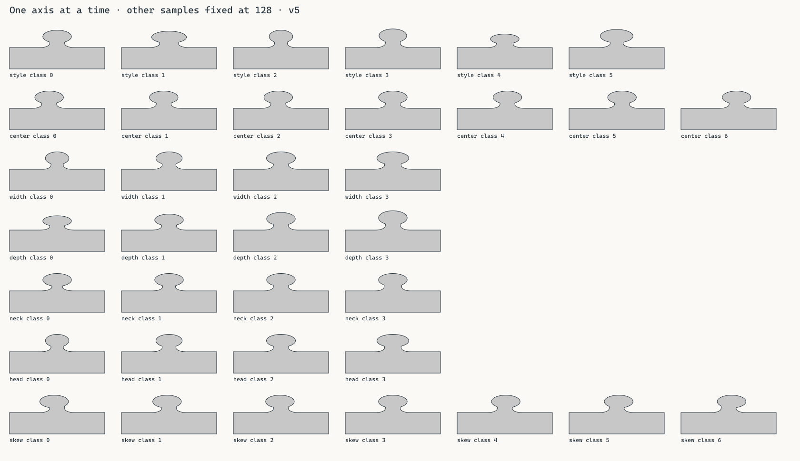
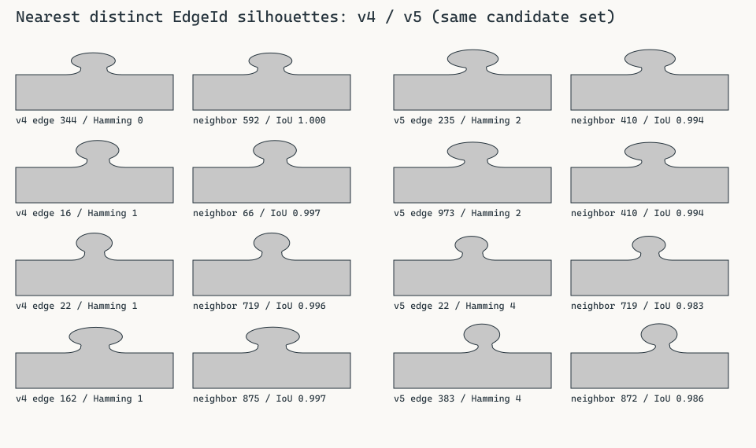
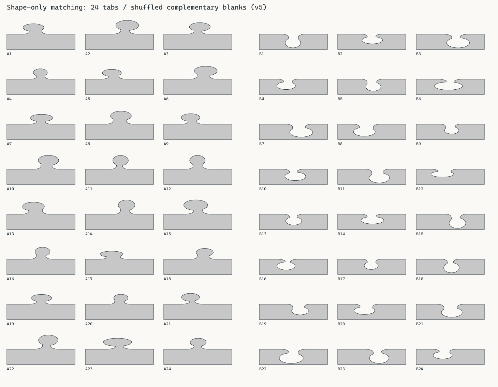
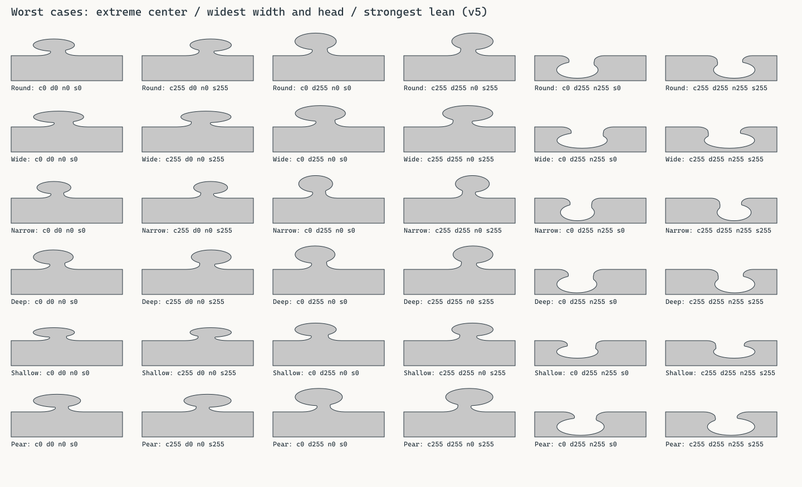
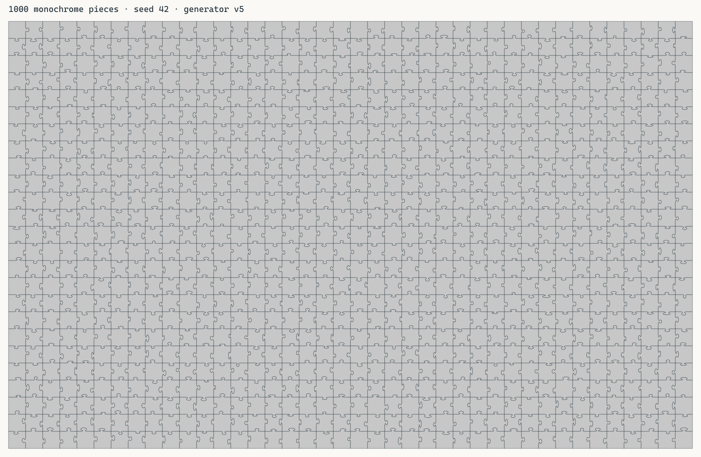
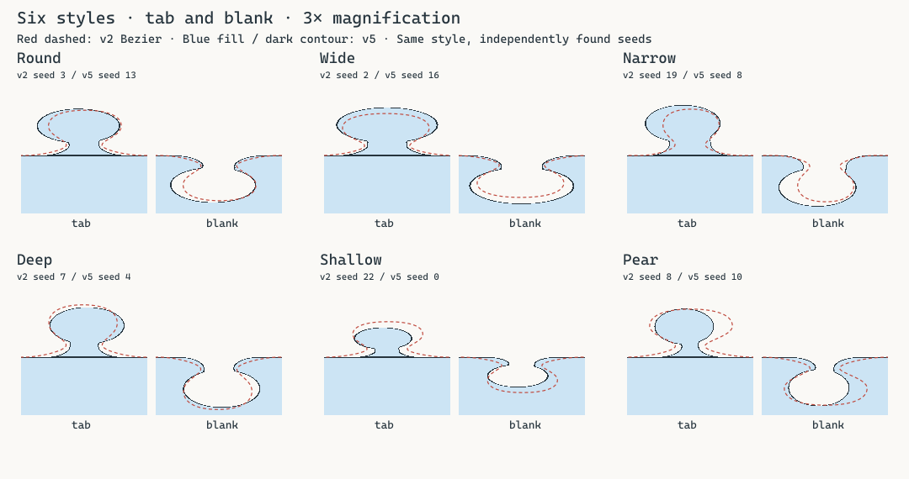

# 辺の視覚的識別性の改善（generator v5）

2026-10-05追記: 旧 v2 の CPU メッシュ生成・CPU picking と専用 feature / example は削除済みです。以下の旧実装・比較コマンドは当時の記録です。現行の構成と検証コマンドは [DEVELOPMENT.md](DEVELOPMENT.md) を参照してください。

2026-10-04追記: 初回リリースでは本書の開発時generator v5をv1に整理しました。形状・hash・seed・配置の計算は同じです。以下のv4/v5表記、測定値と既存benchmarksは記録当時の番号を維持します。

本書は初期v5の形状変更の記録です。意図的に特徴を選んだ旧matching図も含みます。形状を固定した無作為matching・縦横比・macro軸別の追加評価と人間向けtoolは[EDGE_FINGERPRINT_EVALUATION.md](EDGE_FINGERPRINT_EVALUATION.md)を参照してください。

基準は`7d85e57a3ac5e6375f192b1f698e036f77200849`のgenerator v4です。既存6 styleと解析SDFを保ち、6個の8-bit sampleをmacro classとmicro variationとしてdecodeするgenerator v5へ変更しました。100k辺では55,329種類のmacro signatureを得ました。1024本の輪郭の最近傍Hamming距離は平均7.22から29.96へ約4.15倍になりました。100万opaque entireの描画は3回の中央値0.5133 msで、同条件のv4から+3.36%、0.55 msの目安内です。

## クラスと実値

packingとhashはv4から一切変更していません。`scaled = sample * count`、`class = scaled >> 8`、`micro = (scaled & 255) / 255 * 2 - 1`をRust/WGSLで同じ整数処理から求めます。count=7では36/37個、count=4では64個のbyte値が各classに入ります。

| 軸 | class数 | macro実値（micro=0） | micro量 |
| --- | ---: | --- | --- |
| style | 6 | Round / Wide / Narrow / Deep / Shallow / Pear | なし |
| center | 7 | `0.5 + span × [-1, -2/3, -1/3, 0, 1/3, 2/3, 1]` | ±`span × 0.05`、最大±0.004 |
| overall width | 4 | styleのbase width × `[0.86, 0.953333, 1.046667, 1.14]` | ±1% |
| depth | 4 | 下表の4値 | ±1% |
| neck/head | 4 | styleのbase neck/head × `[0.70, 0.86, 1.02, 1.18]` | 比率の±1% |
| head/width | 4 | styleのbase head/width × `[0.86, 0.953333, 1.046667, 1.14]` | 比率の±1% |
| head skew | 7 | `[-0.1, -0.066667, -0.033333, 0, 0.033333, 0.066667, 0.1]` | ±0.005 |

centerのspanが0.08のとき、macro値は`0.42, 0.446667, 0.473333, 0.5, 0.526667, 0.553333, 0.58`です。byte量子化を含む実範囲は概ね0.416〜0.583812。大きなheadではspan全体を小さくし、class順序と差を保ちます。個別のcenterをclampしてclassを潰す方式は使いません。

styleの基準値はv4と同じです。比率を直接制御し、`neck < head < width`を保証します。

| style | width base | depth base | neck/head class 0 / 1 / 2 / 3 | head/width class 0 / 1 / 2 / 3 |
| --- | ---: | ---: | --- | --- |
| Round | 0.46 | 0.18 | 0.3500 / 0.4300 / 0.5100 / 0.5900 | 0.5235 / 0.5803 / 0.6371 / 0.6939 |
| Wide | 0.52 | 0.17 | 0.3706 / 0.4553 / 0.5400 / 0.6247 | 0.5623 / 0.6233 / 0.6844 / 0.7454 |
| Narrow | 0.40 | 0.18 | 0.3652 / 0.4487 / 0.5322 / 0.6157 | 0.4945 / 0.5482 / 0.6018 / 0.6555 |
| Deep | 0.46 | 0.21 | 0.3630 / 0.4459 / 0.5289 / 0.6119 | 0.5048 / 0.5596 / 0.6143 / 0.6691 |
| Shallow | 0.46 | 0.14 | 0.4000 / 0.4914 / 0.5829 / 0.6743 | 0.5235 / 0.5803 / 0.6371 / 0.6939 |
| Pear | 0.48 | 0.19 | 0.2625 / 0.3225 / 0.3825 / 0.4425 | 0.5733 / 0.6356 / 0.6978 / 0.7600 |

depthは`low = base × 0.85 / 0.99`、`high = min(base × 1.15, 0.215) / 1.01`を4等間隔に配置し、最後にmicroを乗せます。上限に当たるDeepでもclassの重複はありません。下限/上限のmicro余白を含め、depthはbaseの85%以上、最大0.215以下です。

| style | depth class 0 | class 1 | class 2 | class 3 |
| --- | ---: | ---: | ---: | ---: |
| Round / Narrow | 0.154545 | 0.171347 | 0.188149 | 0.204950 |
| Wide | 0.145960 | 0.161828 | 0.177696 | 0.193564 |
| Deep | 0.180303 | 0.191159 | 0.202015 | 0.212871 |
| Shallow | 0.120202 | 0.133270 | 0.146338 | 0.159406 |
| Pear | 0.163131 | 0.179711 | 0.196291 | 0.212871 |

上表はmacro中心値です。実際のbyte値で得られる全classのmin/maxは[class-values CSV](../benchmarks/edge-fingerprint-class-values.csv)に保存しました。他の5 sampleを128に固定し、幅・深さ・中心はedge/shortに対する比率、neck/headとhead/widthは比率を記録しています。headの絶対幅にはwidth側のmicroも乗るため最大約±2%、neckの絶対幅には3軸のmicroが乗り最大約±3%ですが、比較しやすい比率そのものは±1%です。全256 sampleを走査し、各軸の実値が厳密に増加し、microで隣のclassを逆転しないことをテストしています。



## 分布と輪郭の識別性

理論上のsignatureは`6 × 7 × 4 × 4 × 4 × 4 × 7 = 75,264`。test/reference feature限定の`EdgeFingerprint`はrawから得るpureなdebug型で、runtimeのstateには保存しません。polarityを含めず、対応する凸凹は同じfingerprintになります。

seed 42、1000×1000 gridに収まる100,000個のinternal EdgeIdを使用しました。H/Vを交互に、`x = (i/2)%999+1`, `y = (i/2)/999+1`とし、orientationを含めて全IDが異なります。x/yが外周を含まないこともassertしています。distinctは**55,329**。一様75,264択なら期待値は約55kなので大きな集中は見られません。

| 軸 | class 0から順の件数 |
| --- | --- |
| style | 16685, 16687, 16637, 16348, 16820, 16823 |
| center | 14615, 14449, 13974, 14321, 14077, 14400, 14164 |
| width | 25121, 25168, 24942, 24769 |
| depth | 25034, 25276, 24848, 24842 |
| neck | 25028, 25092, 24981, 24899 |
| head | 24928, 24807, 24945, 25320 |
| skew | 14429, 14445, 14111, 14426, 13970, 14493, 14126 |

[histogram CSV](../benchmarks/edge-fingerprint-histogram.csv)、[測定結果](../benchmarks/edge-fingerprint-metrics.txt)も保存しています。

輪郭の比較には先頭1024 EdgeIdを使いました。100×100の正方セルを想定し、edge全幅のx=0..100、tabのy=0..22を64×32 pixel中心でsampleしたbinary mask（2048 bits、`EdgeSilhouetteDescriptor`）です。v5は実際の`edge_distance()`、v4はfeature限定の凍結decoderと同じv4 SDFを用います。polarityだけ凸に正規化し、centerは正規化しません。同じ1024本から自身を除いた最近傍をHamming距離で選び、そのペアのIoUも計算しました。shared edgeの反対側を非対応候補に混ぜていません。

| 最近傍の測定値 | v4 | v5 |
| --- | ---: | ---: |
| 平均Hamming（小さいほど似ている） | 7.2207 | **29.9639** |
| 平均Hamming / 2048 | 0.003526 | **0.014631** |
| Hamming中央値 | 7 | **29** |
| Hamming p10 | 3 | **15** |
| Hamming=0の辺数 | 2 | **0** |
| 最近傍ペアの平均IoU（大きいほど似ている） | 0.979827 | **0.915429** |

全ペアの最近傍記録は[nearest CSV](../benchmarks/edge-fingerprint-nearest.csv)です。これはsquare-cell・指定seed・指定解像度での数値評価で、人間のmatching正答率の測定ではありません。極めて似たv5候補も残るため、完全一意性は主張しません。下図は各versionで特に近い4ペアです。



## 単色のmatching・worst case・1000ピース

24凸辺と、同じrawを凹へ反転した24辺を独立のcoprime permutationでシャッフルしています。6styleにつき、左中心/左lean/浅い、右中心/右lean/深い、中央/細い首/大head、中央/太い首/小headの4例を実hashから探しました。全形状のtexture/colorは同じです。[SVG](../benchmarks/edge-fingerprint-preview.svg)と[解答・fingerprint CSV](../benchmarks/edge-fingerprint-answer-key.csv)を用意しました。



worst caseはcenter両端、最大width/head、skew両端、neck/depth各4class、全6styleの384 profilesです。下図は浅い/深い・細い/太い首を抜き出した36例（後半2列は凹）です。実SDFの横断面に対するoffline bisectionで輪郭を描いており、runtime shaderにsolverは追加していません。



40×25、seed 42の全1000ピースも同じ塗りで描きました。内側の線はこのpreview専用で、通常ゲームの未選択ピースへのoutlineは追加していません。共有輪郭から生成しているため組み立て時も凸凹が接合します。



v2は自然さの比較用featureとして維持し、6styleの拡大図も再生成して確認しました。hashとgeneratorが異なるためv2との完全一致を要求していません。



## 安全性・互換性・parity

`ROOT_WIDTH_FACTOR=0.60`、`ROOT_HEIGHT_FACTOR=0.25`、`ROOT_BLEND_FACTOR=0.04`、`MAX_TAB_DEPTH=0.22`は変更していません。head ellipse、stem rounded box、quarter-ellipse root、smooth_min×2、4辺のmax合成は同じです。`sd_box`、`sd_root`、`smooth_min`、`sd_tab`の式も変えていません。

centerのenvelopeは、正規化root半幅にsmooth unionの余白0.00215を足した値と、`head × (0.5347222 + abs(skew))`の大きい方です。後者はhead半幅・skewと両smooth unionの最大補間量を覆います。`span = min(0.08, (0.5 - 0.185 - envelope)/1.05)`とし、microも含め両端18.5%以上の余白を確保します。セルのshortはedge length以下なのでこのsquare側のboundは長辺にも保守的です。

GPUではstyle定数とdepth区間をコンパイル時に畳み込みます。加えて、`sd_tab(q) >= -q.y`により、凸のq.y≤0、凹のq.y≥0では元のmin/max式が厳密にbaselineになります。この半平面だけparameter decode/SDFを省きます。補完式・輪郭・符号は同じで、元の式との数値一致を専用テストと実GPUで確認しています。追加のlength、三角関数、loop、SDF primitive、texture lookupはありません。

- 75,264 macro組み合わせで`0 < neck < head < width`、depth上限、envelope余白を検証しました。
- 384 worst casesを256×64でsquare/4:1長辺の2条件でsampleし、各横断面が単一区間、上下区間が接続、head後にislandがないこと、角/quadを越えないことを確認しました。凹の反転fieldも数値一致します。sampleテストは連続形状の一般的な形式証明を置き換えるものではありません。
- 必須の`root_width_decreases_smoothly_without_a_shelf`、`root_contour_leaves_baseline_horizontally_and_joins_neck_vertically`を変更せず通しました。root以外のhead/stem unionがneck付近で広がる性質も維持しています。
- H/V両方の隣接ピースでraw/fingerprint一致、外周straight、組み立てcoverage=1、画像UV一致を検証しました。
- 実GPUで36 seed/EdgeId/orientationのrawを整数比較しました。6style×6sample軸×全256 byteと384 worst cases、計9,600 profileのmacro整数一致とdecoded 7値の誤差<1e-6を確認しました。
- `sd_tab`と`edge_distance`は390 profiles×2 polarity×3 aspect×187地点、計437,580地点で比較し、誤差≤short×1e-5、境界近傍以外の符号一致を確認しました。実rasterとCPU coverage、凸先端/首/凹のpoint/rectangle picking、selection outlineも通しました。
- 記録当時は`GENERATOR_VERSION=5`です。v4を含む旧definitionを明示的に拒否し、v5の輪郭として読み替えません。

## 性能とメモリ

Windows / Rust 1.97 / RTX 5090 / Vulkan / release、seed 42、4096² RGBA8画像、1024² offscreen、8 warmup後30 frame平均です。ピースを正解位置へ配置し、1M entireでは100万visibleをassertします。ベンチマークにだけGPU完了pollがあり、通常runtimeにはありません。

完全なv4基準コミットでの[before CSV](../benchmarks/fingerprint-v4-before.csv)とv5の[after CSV](../benchmarks/fingerprint-v5-after.csv)では1M opaque draw **0.5075→0.4961 ms**、translucent draw **0.5172→0.5146 ms**でした。ばらつきを確認するため、同じv5 CPU fixtureでshaderをHEADのv4へ戻した3 runと、最終v5 shaderの3 runも測りました。GPU shape以外のstate/seed/grid/camera/buffer条件は共通です。各runは30 frame平均、以下はその3値の中央値です。

| 1M view | visible | v4 draw ms | v5 draw ms | 変化 | v4の3run範囲 | v5の3run範囲 |
| --- | ---: | ---: | ---: | ---: | --- | --- |
| near | 1,156 | 0.0453 | 0.0461 | +1.77% | 0.0439〜0.0505 | 0.0445〜0.0569 |
| medium | 10,404 | 0.0550 | 0.0547 | -0.55% | 0.0548〜0.0600 | 0.0538〜0.0605 |
| opaque entire | 1,000,000 | 0.4966 | **0.5133** | **+3.36%** | 0.4894〜0.5013 | 0.4820〜0.5144 |
| translucent entire | 1,000,000 | 0.5174 | **0.5189** | +0.29% | 0.4967〜0.5204 | 0.5070〜0.5220 |

opaque entireは全runが0.55 ms以下、中央値が+5%目標内です。nearの最も遅いrunは0.0569 msで、単独比較では相対増加が大きく見えるため、無変動とは主張しません。translucentのGPU sort中央値は2.5515→2.5228 msで、alpha blend/透過穴/Z順序の実GPU回帰テストも通りました。GPU完了待ちを含むopaque entireのCPU wall timeはv4 1.4984〜1.8263 ms、v5 1.5506〜2.1860 ms、translucentはv4 6.4688〜6.9482 ms、v5 6.9847〜7.3491 msです。これらを通常ウィンドウのFPSやshader単体の速度として扱いません。

repeatの全16条件（1k/10k/100k/1M × near/medium/entire/translucent）の記録:
[v4-1](../benchmarks/fingerprint-v4-repeat-1.csv)、[v4-2](../benchmarks/fingerprint-v4-repeat-2.csv)、[v4-3](../benchmarks/fingerprint-v4-repeat-3.csv)、[v5-1](../benchmarks/fingerprint-v5-repeat-1.csv)、[v5-2](../benchmarks/fingerprint-v5-repeat-2.csv)、[v5-3](../benchmarks/fingerprint-v5-repeat-3.csv)。

`GpuPieceState`/CPU dense stateは引き続き**16 bytes/piece**、profile storageは**0 bytes/piece**です。rawの`[u32;2]`と4辺のflat varyingを維持し、GPU storage、shared quad寸法、per-piece Mesh/Entity、draw数は増やしていません。1MではCPU/GPU state各16,000,000 bytes、visible/pick visible各4,194,304 bytes、selectable 125,000 bytes、selection+staging 262,144 bytes、画像CPU/GPU各67,108,864 bytes。per-piece Mesh/Entityは0、Bevy組み込みMesh assetが1、通常drawが1のままです。pickingと通常描画は同じshape moduleを使います。

## 再生成・検証

```sh
cargo fmt --check
cargo check --locked
cargo clippy --workspace --locked --all-targets --all-features -- -D warnings
cargo test --locked
cargo test --locked --all-features
cargo build --locked
cargo test -p puzzella-game --release --locked gpu_ -- --ignored --nocapture --test-threads=1
cargo run --release --locked -p puzzella-puzzle --features shape-analysis --example edge_fingerprint_preview -- target
cargo run --release --locked -p puzzella-puzzle --features cpu-geometry-reference --example shape_comparison -- target/fingerprint-v2-v5.svg
```

通常45件と実GPU3件を確認しました。新exampleは`target/edge-fingerprint-preview.svg`、classes/worst/nearest/puzzleのSVG、histogram/class-values/nearest/answer-key CSVとmetrics.txtを生成します。1000ピースのSVGは約25 MBになるためリポジトリにはPNGを保存し、SVGはexampleから再生成します。debug型・v4 decoder・descriptor・solverはtest/reference feature限定です。
