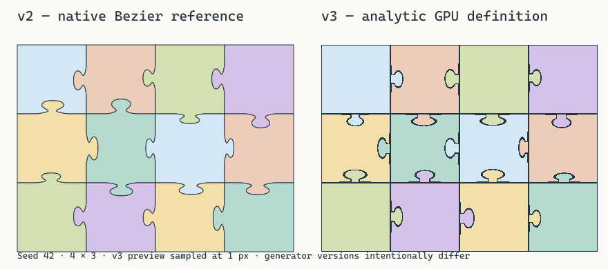

# Procedural renderer 移行結果

2026-10-05追記: 旧 v2 の CPU メッシュ生成・CPU picking と専用 feature / example は削除済みです。以下の旧実装・比較コマンドは当時の記録です。現行の構成と検証コマンドは [DEVELOPMENT.md](DEVELOPMENT.md) を参照してください。

本書は開発時generator v3移行時の記録です。以下の性能・メモリ数値は旧bitonic sort経路の実測です。現在の可視数に応じたradix sortと追加scratch領域は[TRANSPARENT_RADIX_SORT.md](TRANSPARENT_RADIX_SORT.md)、開発時v4の付け根修正は[ROOT_TRANSITION.md](ROOT_TRANSITION.md)、現在のgenerator v1（開発時v5）のclass decodeと検証結果は[EDGE_FINGERPRINT.md](EDGE_FINGERPRINT.md)を参照してください。

2026-10-01、基準22e0aa135c5bdc6a881a3fe2ab6d976087d728baからgenerator v3へ移行しました。100万ピースで個別Mesh・描画Entityは0、通常ピース描画は1 draw、CPU正本とGPU stateは各16 bytes/pieceです。実GPUで1k / 10k / 100k / 1Mを計測し、100万ピース全体表示を確認しました。

## 必須17項目

| # | 項目 | 結果 |
| ---: | --- | --- |
| 1 | 削除した旧runtime | per-piece fill / stroke Mesh・Handle、MeshGeometry生成経路、PieceStroke、BatchManager、combine_meshes、batch rebuild、temporary piece Entity、Transform HashMap、ATTRIBUTE_PIECE_ID、10 pieces/frame登録、通常CPU collision更新を削除 |
| 2 | 残したv2 reference | puzzle/src/shapes.rs / generation.rsと既存テスト。Bezier / lyon / Rayon / worker-local tessellator / U16出力をfeatureまたはtest限定で保持。通常依存からlyonを除外 |
| 3 | v3 hash | 固定u32 avalanche。seed low/high、orientation、edge x/y、parameter domainを全て混合。2 u32へpack。36ケースで実GPUとRustのraw整数完全一致を確認 |
| 4 | analytic形状 | rounded neck・ellipse head・rounded shoulderのsmooth union。canonical signed edge constraintの符号反転でtab / blankを補完。4辺constraintのmaxでピースを構成 |
| 5 | GPU bytes/piece | GpuPieceStateは16 bytes（Vec2 position / u32 z_order / u32 flags）。IDはbuffer index |
| 6 | CPU bytes/piece | 同じ16-byte structのdense Vecが正本。全件の定義・Transform・bounds・UV・profiles・handlesは保持しない。選択集合・holderは別途sparse |
| 7 | 1M memory | steady CPU state 16.0 MB、GPU piece関連buffer約24.8 MB（選択1 slot込み）。4K画像込みCPU約83.1 MB、GPU画像・専用attachment込み約97.1 MB。範囲・一時領域は後述 |
| 8 | Entity数 | ピースEntity 0。headless実GamePluginのplay sceneはcamera + 背景SpriteのTransform 2個、cleanup後camera 1個。UI・Bevy内部resource entityは別途存在し、Nに比例しない |
| 9 | Mesh asset数 | パズルMesh 0。実GPUfixtureのAssets<Mesh>全体は1（Bevy定数asset）。4頂点もshader生成で頂点/index buffer不要 |
| 10 | draw call数 | main puzzle 1 indirect draw。矩形overlay時+1、selection要求時+1。背景・UIは別途 |
| 11 | visible culling | GPU compute、workgroup 256、最大tab深さ0.22×短辺込みquad AABB。visible IDとinstance_countをatomicで生成。通常CPU全件cullingなし |
| 12 | dirty upload | 初期だけ全state転送。dirty IDをsortし連続rangeへcoalesce。ExtractはArc clone。実GPUで1個移動16 bytes / 1 write、idle 0 bytesをassert |
| 13 | picking統合 | state・main visible・quad・profile・SDF・UV・alpha discardを共有。ROI computeで追加圧縮。point 1×1 / 4-byte readback、rectangle bitset、最大3 async slotsと要求順序を維持 |
| 14 | placement計算量 | 中央除外領域外に非重複格子リングを構築し、ChaCha8 Fisher–Yatesでshuffle。O(N)時間・O(N)領域。距離の全件重複探索なし |
| 15 | 1k / 10k / 100k / 1M | 下表と[16行CSV](../benchmarks/procedural-rtx5090.csv)にCPU・GPU・メモリ・visible・countを記録 |
| 16 | 全体表示frame | 1M opaque平均2.1695 ms、translucent平均7.7960 ms（1024² offscreen、GPU同期完了wait込み） |
| 17 | 移行時の最大ボトルネック | 当時の半透明GPU bitonic sort：1Mで210 dispatches、平均2.5750 ms。現在はvisible countを対象としたradix sortへ変更済み |

## Hash / shape仕様

mix32はxor-shift 16、wrapping multiply 0x7feb352d、xor-shift 15、multiply 0x846ca68b、xor-shift 16です。[hash-prospectorのlowbias32](https://github.com/skeeto/hash-prospector)を採用しました。WGSLのu32 overflowとRustのwrapping演算を揃え、shaderのu64演算を使いません。

```text
b = mix32(seed_low ^ 0x9e3779b9)
b = mix32(b ^ seed_high)
b = mix32(b ^ orientation_tag)
b = mix32(b ^ edge_x)
b = mix32(b ^ edge_y)
hash(domain) = mix32(b ^ wrapping(domain * 0x9e3779b9))
Horizontal tag = 0x484f5249; Vertical tag = 0x56455254
```

domain 0はstyle / polarity、domain 1〜6の上位8 bitsはcenter / width / depth / neck / head / asymmetryです。1ワード目はstyle bits 0〜2（1〜6、0はstraight）、polarity bit 3、center shift 4、width shift 12、depth shift 20。2ワード目はneck shift 0、head shift 8、asymmetry shift 16です。外周はraw 0です。

canonical IDはHorizontal(column, row boundary) / Vertical(column boundary, row)。両ピースが同じIDから同じraw profileを再計算します。vertexが各辺2 u32、計8 u32をflat varyingへ渡し、fragmentではhashしません。

| style | width | depth | neck | head |
| --- | ---: | ---: | ---: | ---: |
| Round | .46 | .18 | .14 | .28 |
| Wide | .52 | .17 | .18 | .34 |
| Narrow | .40 | .18 | .12 | .23 |
| Deep | .46 | .21 | .14 | .27 |
| Shallow | .46 | .14 | .16 | .28 |
| Pear | .48 | .19 | .12 | .32 |

比率はv2から継承し、寸法variation ±3.5%、center .5±.025、asymmetry ±.025をquantized sampleからdecodeします。rounded box、ellipse、smooth minimumでtabを構成し、canonical normalの正側へ制限します。正polarityはbaselineとtabのunion、負polarityは同じtabをmirrorしてsubtractします。反対側のピースは同じsigned constraintをnegateするので境界が補完します。

厳密なEuclidean distanceではなく、安価なsigned-distance approximationです。符号がcoverageを決めます。outlineは選択・プレビュー時だけ内側に描き、元の幅min(16 px, short_side * .16)の半分を評価してfwidthで滑らかにします。通常ピースは画像色をそのまま出力します。シルエット外側をdiscardし、mainとpickingのcoverageを合わせます。

UVは((cell + .5) * piece_size + (local.x, -local.y)) / image_sizeです。tabも元画像の連続した位置をsampleし、straight外周で画像領域を保ちます。整数profile一致と形状再構成は検証済みですが、異GPUのfloat・境界画素のbit一致は未検証です。

比較previewは同じseed / grid / sizeのv2輪郭とv3を並べます。v3側はCPU参照の1 px sampleです。version変更による輪郭差を明示し、旧保存形状との互換は主張しません。



## 計測条件

- 以下の数値とCSVはcommit 5328530時点の移行計測です。通常ピースの輪郭を除く修正後の性能再計測は行っていません。
- Windows、Rust 1.97.0、NVIDIA GeForce RTX 5090、Vulkan。CPUモデルは今回取得していません。
- release / locked、seed 42。grid 40×25 / 100×100 / 400×250 / 1000×1000。
- 実4096² RGBA8 sRGB画像（色勾配・checker pattern、67,108,864 bytes）。opaque alpha 255、translucent alpha 128。画像更新は計測frame外。
- offscreen 1024²、MSAA off、8 warmup後30 frame平均。near約1000、medium約10000、entire全Nをassert。
- placement後、同じdense stateを正解位置へ並べ、最密の組み立て状態で全100万を表示。初期配置や全件重ねた状態の計測ではない。
- CPU初期値は各countで1回のwall time。initial upload準備はclone→Arc時間で、GPU allocation / queue転送を含まない。dirtyは1変更のcoalesce system実行で、system登録overheadも含む。
- frameはApp::update＋GPU完了pollのwall time。通常runtimeにwaitはない。Bevy・submission・GPU完了待ちを含み、通常windowのFPSと直接同一ではない。
- GPU stageはtimestamp query。point / rectangleは5要求平均、ROI compute込み。CPUへの非同期readback完了latencyではない。
- Nの小さい条件はnoise・固定overheadの影響が大きく、この1回から厳密な速度比を推定しない。

### CPU

| N | placement ms | state初期化 ms | upload準備 ms | 1 dirty準備 µs |
| ---: | ---: | ---: | ---: | ---: |
| 1,000 | .0123 | .0119 | .0058 | 14.4 |
| 10,000 | .0419 | .0437 | .0687 | 4.8 |
| 100,000 | .3482 | .2451 | .4371 | 5.9 |
| 1,000,000 | 7.3538 | 2.5520 | 4.0398 | 6.1 |

### Opaque GPU / frame

全てms。rectangleは1024²全域です。

| N | view | visible | frame | cull | draw | point + ROI | rect + ROI |
| ---: | --- | ---: | ---: | ---: | ---: | ---: | ---: |
| 1,000 | near | 1,000 | 1.5382 | .0070 | .0422 | .0249 | .3694 |
| 1,000 | medium | 1,000 | 2.0717 | .0069 | .0190 | .0231 | .0598 |
| 1,000 | entire | 1,000 | 1.7599 | .0072 | .0425 | .0252 | .3652 |
| 10,000 | near | 1,156 | 1.0467 | .0064 | .0468 | .0220 | .3514 |
| 10,000 | medium | 10,000 | 1.2946 | .0072 | .0533 | .0238 | .2511 |
| 10,000 | entire | 10,000 | 1.2314 | .0072 | .0540 | .0236 | .2464 |
| 100,000 | near | 1,092 | 1.3211 | .0065 | .0360 | .0222 | .2807 |
| 100,000 | medium | 10,240 | 1.0562 | .0066 | .0443 | .0222 | .1207 |
| 100,000 | entire | 100,000 | 1.4717 | .0081 | .0817 | .0249 | .1121 |
| 1,000,000 | near | 1,156 | 1.3232 | .0119 | .0443 | .0244 | .1616 |
| 1,000,000 | medium | 10,404 | 1.2574 | .0122 | .0530 | .0223 | .1182 |
| 1,000,000 | entire | 1,000,000 | 2.1695 | .0275 | .4877 | .0290 | .5073 |

### Translucent全体表示

alpha semanticsを維持した経路も同じtexture / stateで実測しています。

| N / visible | frame ms | cull ms | sort ms | draw ms | point + ROI ms | rect + ROI ms |
| ---: | ---: | ---: | ---: | ---: | ---: | ---: |
| 1,000 | 2.6862 | .0075 | .3674 | .0419 | .0224 | .3650 |
| 10,000 | 3.0034 | .0073 | .8147 | .0528 | .0241 | .2554 |
| 100,000 | 4.7634 | .0084 | 1.4541 | .0790 | .0240 | .1217 |
| 1,000,000 | 7.7960 | .0275 | 2.5750 | .5153 | .0300 | .5032 |

## メモリ範囲と内訳

MBは10⁶ bytes、MiBは2²⁰ bytes。下表は要求した論理buffer / imageサイズで、OS RSS・driver residency・Bevy全体のheap / targetsまで含む総消費量ではありません。

| 1M時 | bytes | 備考 |
| --- | ---: | --- |
| CPU正本 | 16,000,000 | 16/piece、Vec capacityを記録 |
| GPU state | 16,000,000 | 16/piece |
| main visible IDs | 4,194,304 | capacity 1,048,576、sort padding兼用 |
| picking ROI IDs | 4,194,304 | clickのvertex提出を減らす追加buffer |
| selectable bitset | 125,000 | 31,250 words |
| selection + staging | 262,144 | 1 slot、各131,072。最大3 slotsなら786,432 |
| indirect / dummy | 36 | main 16 + pick 16 + dummy 4 |
| piece関連GPU計 | 24,775,788 | 約23.63 MiB、3 slots時25,300,076 |
| CPU / GPU画像各1枚 | 67,108,864 | 4096² RGBA8、64 MiB。CPU Image.dataも保持 |
| 専用main depth | 4,194,304 | 1024² Depth32Float |
| rectangle attachment | 1,048,576 | 1024² R8Unorm |
| point ID / depth | 8 | 1×1各4 bytes |

画像込みsteady CPUデータは約83.1 MB、専用attachment込みGPUデータは約97.1 MB（最大3 slotsと透明sort uniform込み約97.8 MB）です。小さなuniform / bind group、alignment、pipeline / shader、Bevyのoutput・postprocess targets、UI、timestamp計測、driver追加領域は含みません。画像・画面寸法に依存する領域とN依存の領域を分けています。

固定stateの16 bytes/piece以外にも、holder・選択・preview・dirty・previous集合、drag offsets、command / readbackが必要数に比例します。100万件の選択・移動では追加メモリとCPU処理が発生します。全件rectangle結果のID Vecだけでも4 MBです。

初期化にはplacement Vec 8 MB、state 16 MB、初回upload Arc 16 MBが必要です。Vec clone→Arc変換中は一時的にもう16 MBが存在し得ます。通常idle frameで全stateをコピーしません。CPU / GPU実RSSとピークresident量は未測定です。

## 検証・制限

必須fmt、check、all-targets / all-features clippy（warnings denied）、通常test、all-features test、buildが成功しました。通常37件（core 2 / puzzle 13 / game 22）、実GPU3件を別途実行しました。all-features testのWindows profiling初期化はSymInitialize FAILED code 87を出力しましたが、全testとコマンドは成功しています。

形状安全性、6style、seed全bits、共有辺補完、straight外周、組み立て面積・UVをCPUテスト、Rust / WGSL整数をGPUで確認しました。実GPUの描画画素とSDF oracle、tab / neck / blankのpoint / rectangle、alpha blend順序、alphaゼロ越しの選択、tabだけの可視性、pan / zoom / viewport offset、state uploadを検証しています。

Ctrl、box、multi-drag、遅延応答、最終座標→Release→snap、focus loss / pause、placed lock、preview、session cleanupと再生成の通常テストを維持しました。ピース数に比例するEntity / Meshは作りません。ビルドした実行ファイルを8秒間起動し、初期化・継続動作・stderrにエラーがないことも確認しました。通常windowの全手動操作、macOS / Linux、異GPU / driverは未検証です。

移行時の半透明経路はcapacity全体のbitonic sortで、nearでもO(capacity log² capacity)、1Mで210 passesでした。現在は可視IDの安定圧縮と8bit × 3 passのradix sortに変更し、準備・圧縮込み11 dispatchです。histogramとscatterはGPUのvisible countからindirect dispatchします。不透明はsortしません。現行のnear / medium / entire計測、順序互換性、scratchメモリは[TRANSPARENT_RADIX_SORT.md](TRANSPARENT_RADIX_SORT.md)を参照してください。

GPU cullingはO(N)。大量の重なりはraster / picking候補、全件rectangleはdecodeと選択集合更新の負荷になります。通常CPU idleに全件走査はありませんが、全選択などの明示操作と稀なZ再圧縮には大規模処理があります。

## 再実行

```sh
cargo fmt --check
cargo check --locked
cargo clippy --workspace --locked --all-targets --all-features -- -D warnings
cargo test --locked
cargo test --locked --all-features
cargo build --locked
cargo test -p jigsall-game --release --locked gpu_ -- --ignored --nocapture --test-threads=1
cargo run --release --locked -p jigsall-puzzle --features cpu-geometry-reference --example shape_comparison -- target/shape-comparison.svg
```

benchmarkはtarget/procedural-benchmark.csvを更新します。今回の記録は[benchmarks/procedural-rtx5090.csv](../benchmarks/procedural-rtx5090.csv)。通常lyon除外はcargo tree --locked -e normal -i lyonで確認できます。
