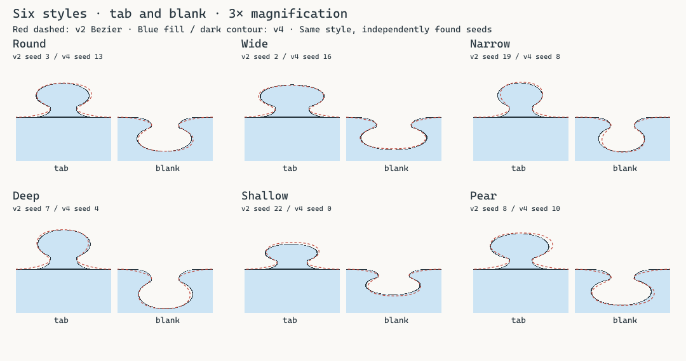
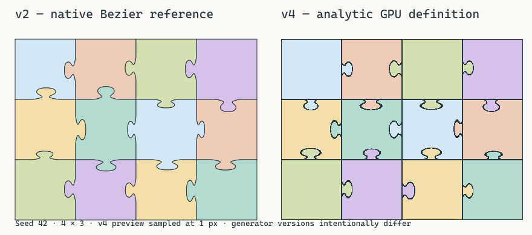

# タブ付け根の修正結果（generator v4）

本書はv4時点の記録です。付け根の式を維持して辺の識別性を高めた現在のv5は[EDGE_FINGERPRINT.md](EDGE_FINGERPRINT.md)を参照してください。

2026-10-01。commit 4994851のprocedural v3を基準に、sd_tabの横長shoulderを凹形の楕円弧へ置き換えました。head・stem、hash、EdgeProfile、GPU renderer、picking、dense state、placementは維持しています。

## 指定された10項目

| # | 項目 | 結果 |
| ---: | --- | --- |
| 1 | 旧shoulder | Rust / WGSL双方から横長rounded boxを削除。baseline直上に広い平坦部分を追加する処理が台形状の裾を作っていた |
| 2 | 新しい数式 | 横幅をheightで絞るquarter-ellipse fillet。baselineで水平接線、neckで垂直接線を持つ。式は下記 |
| 3 | 定数 | ROOT_WIDTH_FACTOR=.60、ROOT_HEIGHT_FACTOR=.25、ROOT_BLEND_FACTOR=.04。両言語で対応を明記。既存head / stemとそのblend .06は変更なし |
| 4 | 6style比較 | Round / Wide / Narrow / Deep / Shallow / Pearを3倍拡大し、v2輪郭と重ねて確認。全styleで平坦な肩が消え、曲線でneckへ接続する |
| 5 | tab / blank | 凸・凹を同じ優先度で確認。凸の裾と凹の台形窪みを除去。headへの接続とneckの太さを保持 |
| 6 | Rust / WGSL parity | 6style×2polarity×3aspect×17height×11横位置＝6,732サンプルでsd_tab / edge_distanceを実GPU比較。誤差上限short_side×1e-5、境界近傍以外の符号も一致。raw hash 36ケースの整数一致も維持 |
| 7 | shared edge | 既存のcanonical EdgeId / signed constraintの反転構造を変更せず、隣接補完・straight外周テスト成功 |
| 8 | tiling | 既存の組み立てcoverage == 1とUV parityテスト成功 |
| 9 | GPU test | 描画 / point / rectangle parity、通常ピースの画像色、選択 / preview輪郭、透明度 / Z順序、透明穴、tab-only visibilityの実GPU2テスト成功 |
| 10 | 1M opaque before / after | entire draw平均0.5248 → 0.5037 ms。約0.5 msの範囲を維持し、明確な悪化は見られない。測定条件・限界は下記 |

## 数式

qはcanonical辺に沿う座標、y=q.yはbaselineから凸側への高さです。x=q.x-center×length、d=depth×short_sideとします。

```text
n = neck_width × length / 2
r = n + (width × length / 2 - n) × 0.60
h = d × 0.25
a = r - n

F(x,y) = (1 - length(((abs(x)-r)/a, (y-h)/h))) × min(a,h)
root(x,y) = max(F(x,y), abs(x)-r, y-h, -y)

tab = max(smooth_min(smooth_min(head, stem, d×.06), root, d×.04), -y)
```

ellipseの外側をroot内部として使い、0≤y≤h、abs(x)≤rへ制限します。rootの左右輪郭は次の幅を持ちます。

```text
t = y / h
half_width(y) = r - a × sqrt(t × (2-t)),  0≤t≤1
```

線形補間や台形の斜辺ではなく、凹形の楕円弧です。パラメータ表示x=r-a sin(theta)、y=h(1-cos(theta))なら、theta=0で水平、theta=π/2で垂直の接線を持つことが分かります。実装はlengthとmaxのみで、このsin / cosや反復solverはshaderにありません。

Roundのnominal profileなら、全root幅は.14+(.46-.14)×.60=.332×length、heightは.045×short_sideです。従来の.46×lengthの横長boxをそのまま置きません。64 seeds・3 aspectでroot幅の単調減少、最終tabの幅の連続性、baseline付近で幅が直ちに縮むことを検証しました。既存head / stemのsmooth unionはneck上部でheadへ広がるため、tab全体に単調減少を要求していません。

max(-y)のbaseline clippingは残しています。edge_distanceのpositive union / negative mirrored subtraction、隣接側の符号反転もそのままです。

## Visual comparison

赤破線はv2のBezier、青の塗りと暗い輪郭はv4です。styleを揃えるためseedをgeneratorごとに探索し、各seedを図に記載しています。hashが異なるv2との完全一致を主張する比較ではありません。blankは同じpositive profileのpolarityを反転して実際のsubtract式をsampleしています。



全styleでrootは広い平坦な肩から曲線へ変わりました。Wideも横長boxの裾を持たず、Narrowはneckを維持、Deepは深さを維持、Shallowは短い接続でも曲率を保持、Pearはheadの非対称性を維持しています。



previewはCPU参照をsampleした検証図で、通常プレイの常時outlineではありません。通常ピースは引き続き画像色のみ、選択 / preview時だけ輪郭を描きます。

## Performance

beforeはcommit 4994851、afterは今回のv4です。Windows / RTX 5090 / Vulkan / release / seed 42、実4096² RGBA8画像、1024² offscreen、8 warmup後30 frame平均。1000×1000の全ピースを正解位置へ並べ、全100万visibleをassertしています。通常frameにGPU同期waitはなく、ベンチマークだけApp::update後に完了pollします。

| 1M opaque | visible | draw GPU before ms | after ms | frame before ms | after ms |
| --- | ---: | ---: | ---: | ---: | ---: |
| near | 1,156 | .0432 | .0453 | 3.1650 | 1.0979 |
| medium | 10,404 | .0513 | .0543 | 3.3734 | 1.1527 |
| entire | 1,000,000 | .5248 | .5037 | 3.3890 | 1.7643 |

entireのGPU draw差は約-4%です。1回の計測で、GPU clockや環境負荷の変動もあるため、shape変更による高速化とは判断しません。CPUの初期化・frame wall timeにも大きな変動があり、全体frame短縮を今回の変更へ帰属させません。主な確認はGPU drawが約0.5 msを維持し、明確な性能悪化がないことです。

旧1 ellipse + 2 rounded boxesと同様、今回もhead ellipse・stem rounded box・root ellipseの3つのlengthと2 smooth_minです。shaderへのloop、反復solver、三角関数、cubic root solveは追加していません。

1k / 10k / 100k / 1M、opaqueのnear / medium / entireとentire translucentを再計測しました。元データは[before CSV](../benchmarks/root-v3-before.csv)と[after CSV](../benchmarks/root-v4-after.csv)です。

## Generator compatibility

同じPuzzleDefinitionから同じ輪郭を再構成する仕様なので、形状式変更は互換性の破壊です。GENERATOR_VERSIONを3から4へ更新し、通常validateはv2 / v3を拒否します。旧定義を同じversionのまま異なる輪郭として扱いません。自動変換やv3 runtime fallbackは追加していません。v2 reference featureは引き続きversion 2を受け入れます。

hash・raw integer profile・seed・PieceId・grid・UV・配置方式は変更していません。

## Reproduce

```sh
cargo fmt --check
cargo check --locked
cargo clippy --workspace --locked --all-targets --all-features -- -D warnings
cargo test --locked
cargo test --locked --all-features
cargo build --locked
cargo test -p puzzella-game --release --locked gpu_ -- --ignored --nocapture --test-threads=1
cargo run --release --locked -p puzzella-puzzle --features cpu-geometry-reference --example shape_comparison -- target/root-comparison.svg
```

shape_comparisonは組み立て図に加えroot-comparison-roots.svgを出力します。上記6つの必須チェックは成功、通常40件（core 3 / puzzle 15 / game 22）とall-featuresの40件、実GPU3件（形状・透明度・benchmark）を確認しました。all-featuresでは以前と同じWindows profiling初期化のSymInitialize code 87診断が出ますが、全testは成功しています。異GPU / OSの検証は行っていません。
